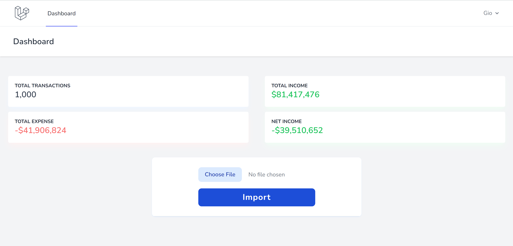

## Source Code For Lesson To Deploy Laravel App To Production
See the video for details here: 

YouTube Channel: [ProgramWithGio](https://youtube.com/programwithgio)

You can use [transactions.csv](transactions.csv) as a sample import file.

